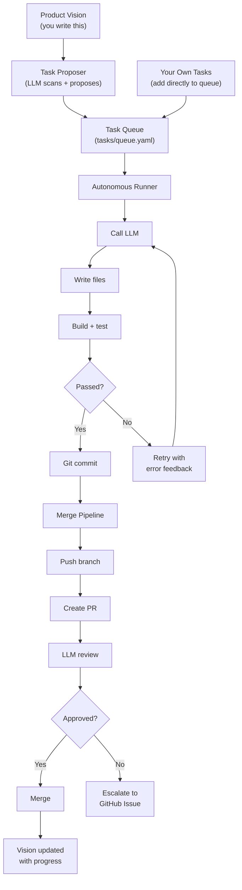
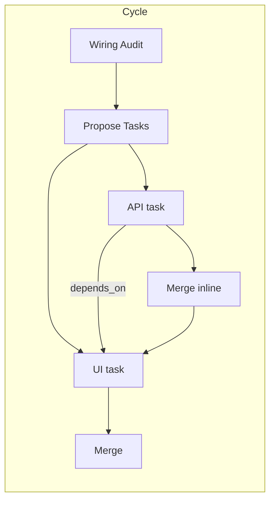

# OpenTangl

Describe what you want built. OpenTangl reads your vision, proposes tasks, writes code, reviews its own PRs, and merges — in a loop, across multiple repos, without you touching anything.

It's not a code generator. It's an autonomous development team that runs while you sleep.

```
npx tsx src/cli.ts autopilot --projects my-api,my-frontend --cycles 3
```

```
🧠 AUTOPILOT MODE (job: a3f8c21b)
   Cycles: 3 | Projects: my-api, my-frontend

🔌 WIRING AUDIT — checking cross-project integration...
   ✅ All clear — no wiring gaps detected.

🤖 Proposing tasks aligned to product vision...
   ⏳ add-user-auth-api [my-api]
   ⏳ wire-auth-ui [my-frontend] (depends on: add-user-auth-api)
   ⏳ add-dashboard-page [my-frontend]
   ⏳ fix-api-validation-tests [my-api]

📌 Task: add-user-auth-api
   🤖 Writing code... 3 files
   ✅ Build passed | ✅ Tests passed
   📝 PR #12 created → LLM review → ✅ Merged

📌 Task: wire-auth-ui
   🤖 Writing code... 2 files
   ✅ Build passed
   📝 PR #42 created → LLM review → ✅ Merged

🩺 SANITY CHECK — Score: 95/100
   ✅ 4/4 passed | 3 merged | 1 escalated
```

---

## What It Does

1. **Reads your product vision** — a plain-English doc describing what you're building and where it's going
2. **Scans your codebase** — understands your project structure, frameworks, and existing code
3. **Proposes tasks** — the LLM decides what to build next, aligned to your vision
4. **Executes autonomously** — writes code, runs build/test verification, retries on failure (up to 3 attempts with error feedback)
5. **Reviews its own PRs** — a second LLM pass reviews the diff for breaking changes, security issues, and code quality
6. **Merges or escalates** — clean PRs get merged automatically; flagged PRs create GitHub issues for you to review
7. **Updates the vision** — after each run, OpenTangl updates your priorities doc with what was accomplished
8. **Repeats** — run as many cycles as you want

Works on **single repos** or **multiple repos** simultaneously (API + frontend, monorepos, etc.). Understands cross-project dependencies — won't wire a UI to an API endpoint that hasn't been merged yet.

---

## Get Started

### With an AI coding tool (fastest)

Open this repo in **Cursor**, **VS Code + Copilot**, **Claude Code**, or any AI agent with file access, and ask:

> "How do I get started?"

The agent reads the setup guide and walks you through everything — project detection, config generation, vision doc creation, and your first run. Zero manual config editing.

**Using another desktop agent?** Tell it:

> "Read `.cursor/rules/getting-started.md` in this repo and follow the setup instructions for my project."

### Manual setup

```bash
# 1. Clone and install
git clone <repo-url>
cd opentangl
npm install

# 2. Configure your LLM provider
cp .env.example .env
# Edit .env — add your OpenAI or Anthropic API key

# 3. Set up your project
cp examples/projects.yaml.example projects.yaml

# 4. Write your product vision
mkdir -p docs/environments/my-product
cp examples/product-vision.md.template docs/environments/my-product/product-vision.md

# 5. Initialize the task queue
mkdir -p tasks
echo "tasks: []" > tasks/queue.yaml

# 6. Run
npx tsx src/cli.ts autopilot --projects my-project --cycles 1 --feature-ratio 0.8
```

---

## How It Works



### Multi-project awareness

When working across repos (e.g., API + frontend), OpenTangl:

- Runs a **wiring audit** at the start of each cycle to detect integration gaps
- Uses `depends_on` to sequence tasks across projects (API endpoint before UI wiring)
- Shares **cross-project context** so the LLM sees both codebases
- Merges dependency tasks **inline** to unblock downstream work



### Safety

- **LLM code review** — every PR is reviewed by a second LLM pass before merging
- **Build verification** — code must pass build and tests before committing
- **Retry with feedback** — failed builds feed errors back to the LLM (up to 3 attempts)
- **Protected files** — sensitive files (auth, config, infra) can be marked as untouchable
- **Auto-escalation** — critical review concerns close the PR and create a GitHub issue instead
- **Sanity check** — post-run validation catches orphaned tasks, stuck queues, and inconsistencies

---

## Task Queue

OpenTangl uses a task queue (`tasks/queue.yaml`) to track what work needs to be done. Tasks get into the queue two ways:

**LLM-proposed** — In `autopilot` mode, the LLM reads your vision doc, scans the codebase, and proposes tasks. You can also run `propose preview` to see what it would suggest, or `propose queue` to add proposals without executing.

**User-written** — Add tasks directly to `tasks/queue.yaml`. OpenTangl executes them the same way it executes LLM-proposed tasks.

```yaml
tasks:
  - id: add-login-page
    status: pending
    workflow: auto
    prompt: prompts/auto-implement.md
    project: my-frontend
    task_type: feature
    variables:
      feature_name: "login page"
      feature_description: >
        Create a /login page with email and password fields,
        form validation, and a submit handler that calls
        POST /auth/login. Show error states for invalid
        credentials. Redirect to /dashboard on success.
    context_files:
      - src/app/page.tsx
      - src/services/auth.ts
    depends_on:
      - add-auth-endpoint
```

| Field | Required | Description |
|-------|----------|-------------|
| `id` | Yes | Unique kebab-case identifier |
| `status` | Yes | Set to `pending` for new tasks |
| `workflow` | Yes | Use `auto` |
| `prompt` | Yes | Use `prompts/auto-implement.md` |
| `project` | Yes | Must match an `id` from `projects.yaml` |
| `task_type` | No | `feature`, `architecture`, or `maintenance` |
| `variables.feature_name` | Yes | Short name for the task |
| `variables.feature_description` | Yes | Detailed description of what to build |
| `context_files` | No | Files the LLM should read before starting |
| `depends_on` | No | Task IDs that must complete first |

---

## Configuration

### projects.yaml

Defines the projects OpenTangl manages. See `examples/projects.yaml.example` for the full schema.

```yaml
projects:
  - id: my-app
    name: my-app
    path: ../my-app
    type: react-vite
    scan_dirs: [src]
    verify:
      - command: npm
        args: [run, build]
```

### Product vision

The vision doc is the most important file. It tells OpenTangl *what* to build. See `examples/product-vision.md.template`.

Two sections:

- **Origin & Direction** — you write this. OpenTangl never modifies it.
- **Current Priorities** — OpenTangl maintains this after each run.

### .env

```bash
# Pick one (or both)
OPENAI_API_KEY=sk-...
ANTHROPIC_API_KEY=sk-ant-...

# Which provider to use by default
DEFAULT_AGENT=openai  # or: anthropic
```

---

## CLI

```bash
npx tsx src/cli.ts <command> [options]
```

### Running tasks

| Command | What it does |
|---------|-------------|
| `autopilot` | Full loop: propose tasks, execute, review, merge, repeat |
| `schedule loop` | Execute all pending tasks in the queue |
| `schedule watch` | Poll for new tasks every 5 minutes and execute continuously |
| `next` | Execute just the next pending task |

### Proposing tasks

| Command | What it does |
|---------|-------------|
| `propose preview` | LLM proposes tasks — preview without adding to queue |
| `propose queue` | LLM proposes tasks — add them to the queue |

### Managing work

| Command | What it does |
|---------|-------------|
| `queue` | Inspect the task queue |
| `merge` | Run the merge pipeline on completed branches |
| `prune` | Remove completed/failed/skipped tasks from the queue |
| `wire` | Run a cross-project wiring audit |

### Flags

| Flag | Description |
|------|-------------|
| `--projects api,frontend` | Which projects to target |
| `--cycles 3` | How many propose-execute loops (autopilot) |
| `--feature-ratio 0.8` | 80% features, 20% maintenance/tests |
| `--agent openai` | Override the default LLM provider |

---

## Supported Project Types

OpenTangl works with any JavaScript/TypeScript project. Tested configurations:

- React + Vite
- Next.js
- Serverless Framework (JS and TS)
- Express / Fastify
- Node.js + TypeScript
- Monorepos (workspace-based)

Other languages are on the roadmap.

## LLM Providers

| Provider | Tool use (agentic) | Single-shot | Status |
|----------|-------------------|-------------|--------|
| OpenAI (GPT-4o, Codex) | Yes | Yes | Full support |
| Anthropic (Claude) | Yes | Yes | Full support |

---

## Contributing

See `AGENTS.md` for code style and conventions. The codebase is TypeScript, strict mode, named exports only.

Key areas for contribution:

- **LLM adapters** — add support for Gemini, local models, etc.
- **Project types** — extend detection for Python, Go, Rust
- **Merge strategies** — GitLab/Bitbucket support (currently GitHub only)

## License

MIT
