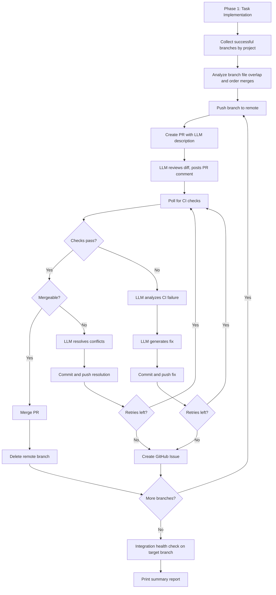

# Phase 2: Autonomous Merge Pipeline

## Overview

Build an autonomous merge pipeline (Phase 2) that runs after the existing task implementation phase (Phase 1). It pushes branches, creates GitHub PRs with LLM-generated descriptions, reviews diffs via LLM, handles CI failures and merge conflicts through an LLM retry loop, and escalates unresolvable issues to GitHub Issues.

## Architecture

The merge pipeline runs automatically after `scheduler.loop()` completes. It replaces the current local merge logic in the scheduler with a GitHub PR-based workflow for all projects.



## Key Design Decisions

- **Queue state commits stay direct-to-main** in the orchestrator repo (not PR-gated). Only feature branches go through the PR pipeline.
- **All projects use GitHub PRs**, including the orchestrator itself. This replaces the current local merge in `scheduler.ts` lines 476-518.
- **Branch ordering matters.** Before merging, analyze which branches touch overlapping files. Merge non-overlapping branches first, then sequential merge for overlapping ones with conflict resolution after each.
- **Unresolvable scenarios create a GitHub Issue** with full context and leave the PR open for manual review.

## New Modules

### 1. `src/github-ops.ts` -- GitHub CLI Wrapper

Wraps `gh` CLI commands as async functions. All GitHub interactions go through this module.

Functions:
- `pushBranch(cwd, branch)` -- push branch to remote
- `createPullRequest(cwd, { branch, targetBranch, title, body })` -- returns PR number + URL
- `getPullRequestStatus(cwd, prNumber)` -- returns checks status, mergeable state, conflict info
- `postPRComment(cwd, prNumber, body)` -- post LLM review as comment
- `mergePullRequest(cwd, prNumber, { strategy })` -- merge with squash/merge/rebase
- `deleteBranch(cwd, branch)` -- delete remote branch after merge
- `createIssue(cwd, { title, body, labels })` -- create GitHub Issue for escalation
- `getPRDiff(cwd, prNumber)` -- get the full diff for LLM review
- `getConflictFiles(cwd, branch, targetBranch)` -- list files with conflicts

### 2. `src/merge-pipeline.ts` -- Phase 2 Orchestrator

The main merge pipeline module. Takes a list of completed branches grouped by project and processes them through the PR workflow.

### 3. `src/conflict-resolver.ts` -- LLM Conflict Resolution

Handles extracting conflict markers, building a prompt, and applying the LLM's resolution.

### 4. `src/diff-reviewer.ts` -- LLM Diff Review

Reviews the PR diff before merge to catch logical issues that build/test won't find.

### 5. `src/branch-analyzer.ts` -- Branch Ordering

Analyzes which files each branch touches and determines optimal merge order.

## Modified Modules

- `projects.yaml` -- Add merge config per project
- `src/project-registry.ts` -- Add MergeConfig to ProjectConfig
- `src/queue-manager.ts` -- Add merge tracking fields
- `src/scheduler.ts` -- Wire in merge pipeline
- `src/cli.ts` -- Add standalone merge command
- `src/auto-merge.ts` -- Deprecate local merge functions
- `src/rollback-manager.ts` -- Fix parameter swap bug

## Adding a New Project

When registering a new project in `projects.yaml`, ensure the following are configured for the merge pipeline to work correctly:

### 1. Verify commands (required)

The `verify` array defines the local quality gates run during Phase 1 (post-implementation) and Phase 2 (post-merge integration check). **Always include the project's test runner if one exists.** Without it, code that passes the build but fails tests will be merged.

Example for a Node.js project with Jest:

```yaml
- id: my-project
  name: my-project
  path: ../my-project
  type: typescript-node
  verify:
    - command: npx
      args: [tsc, --noEmit]
    - command: npm
      args: [test]
```

Example for a plain JS project with Jest + webpack:

```yaml
verify:
  - command: npx
    args: [webpack, --mode, production]
  - command: npm
    args: [test]
```

If the project has no test suite yet, omit the test step but plan to add it. The merge pipeline can only gate on what's configured here and any GitHub Actions CI checks on the remote.

To make a verify step non-blocking (e.g., linting), add `optional: true`:

```yaml
verify:
  - command: npx
    args: [tsc, --noEmit]
  - command: npm
    args: [test]
  - command: npm
    args: [run, lint]
    optional: true
```

### 2. Merge config (optional, defaults applied)

If not specified, defaults are applied: `target_branch: main`, `strategy: squash`, `max_attempts: 3`, `auto_delete_branch: true`, `ci_timeout_ms: 300000`.

Override per project as needed:

```yaml
merge:
  target_branch: develop      # merge target (default: main)
  strategy: merge             # squash | merge | rebase
  max_attempts: 5             # retry limit before escalation
  auto_delete_branch: true    # delete branch after merge
  ci_timeout_ms: 600000       # CI polling timeout (10 min)
```

### 3. Checklist for new projects

- Add the project entry to `projects.yaml` with `id`, `name`, `path`, `type`, `scan_dirs`
- Add `verify` commands including the test runner (`npm test`, `npx jest`, etc.)
- Add `merge` config if defaults are not suitable
- Add `sensitive_files` for files the proposer should not modify autonomously
- Ensure `gh` CLI has access to the project's GitHub repo (`gh auth status`)
- Ensure the project has a remote (`git remote -v`) so push/PR operations work

## Unresolvable Scenarios (GitHub Issue Escalation)

1. CI failures that persist after N fix attempts
2. Merge conflicts in binary files
3. Conflicts where both sides substantially rewrote the same region
4. LLM review flags critical concerns
5. Integration test failures after batch merge
6. Flaky CI (detected by different failures each attempt)
7. Protected branch rules or required human approvals
